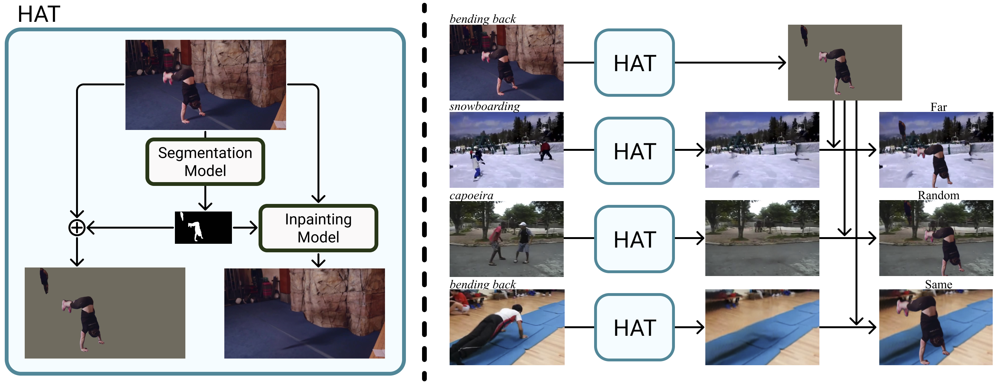

## **Enabling Detailed Action Recognition Evaluation Through Video Dataset Augmentation**  
*Jihoon Chung, Yu Wu, Olga Russakovsky*  
*Princeton University*

This is the official implementation of [HAT](https://openreview.net/forum?id=eOnQ2etkxto) toolkit using [SeMask](https://github.com/Picsart-AI-Research/SeMask-Segmentation) and [E2FGVI](https://github.com/MCG-NKU/E2FGVI). Although we provide a demo usage of the toolkit using [MMAction2](https://github.com/open-mmlab/mmaction2), the toolkit can easily be implemented in other human action recognizer models. 

## Methods

The toolkit makes use of three modified datasets generated from the original video dataset.

1. Background Only Videos  
Human segmentation is removed from the video frames and inpainted to make the person 'invisible'.
2. Human Only Videos  
Only the human region is remained intacted, rest of the pixels are substituted with a dataset average color. 
3. Action Swap Videos  
A background swapped from a different video.

## Implementations

For efficiency, we only keep original frames, human segmentations, and Background Only Videos. We advise to generate Human Only Videos and Action Swap Videos online within the dataloader. 

### Data Preparation

Copy (or softlink) your video dataset in the `data/{dataset_name}/ori` folder. We have included two example videos from Kinetics-400. The given videos are sufficient enough to demo the toolkit.

### Generate Human Segmentation

Please check the [instructions](SeMask-FAPN).

### Generate Inpainted Frames

Please check the [instructions](E2FGVI).

## Testing HAT using MMAction2

Here, we use MMAction2 as the basis for our human action recognizer in our paper. You can implement your own dataloader if your tool does not involve MMAction2. 

Please check the [instructions](mmaction2).

## Downloads

We offer pre-generated files (human segmentation, inpainting frames, and original frames) for Kinetics-400 and UCF101. 

- [Kinetics-400](https://drive.google.com/drive/folders/1IiLGMykqUjQp0IFHB-Yl7Hk1Yzzswrgx?usp=sharing)
- [Kinetics-400, E2FGVI as inpainting](https://drive.google.com/drive/folders/14aTyHWjS7d3L3gKf7cu9o1tY3VysRIvo?usp=sharing)
- [UCF101](https://drive.google.com/drive/folders/1V6hmDo6H4j1weyM6oRhWbPBniLz1gle6?usp=sharing)

## Acknowledgements

We are grateful for the support from the National Science Foundation under Grant No. 2112562, Microsoft, Princeton SEAS Project X Innovation Fund, and Princeton First Year Ph.D. Fellowship to JC.
