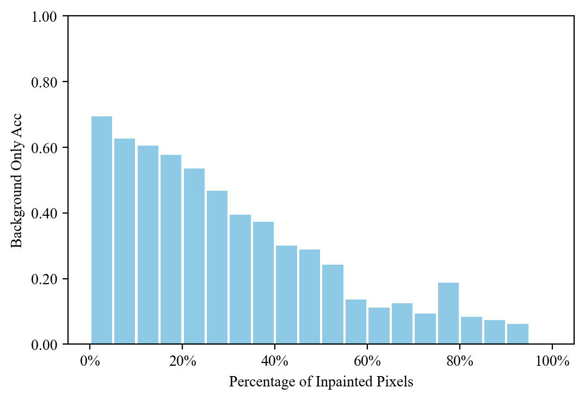
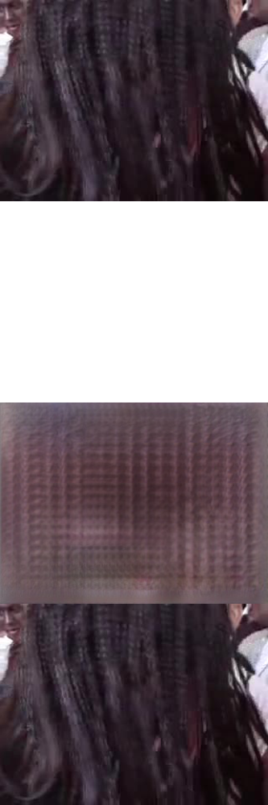

## Percentage of Synthetic Pixels

We plot the accuracy of [SlowFast](https://github.com/open-mmlab/mmaction2/blob/master/configs/recognition/slowfast/slowfast_r152_r50_4x16x1_256e_kinetics400_rgb.py) by the percentage of the synthetic pixels each video has. 

|   |  |  |
| ------------- | ------------- | ------------- |
|    |    |   |

## Percentage of Human Mask

Here we show some of the sameple frames per human mask percentage (±2%).  
To assure that the Action Swap Videos have enough information for both background and foreground, we only select frames that have 5%-50% of human coverage.

| 0% | 10% | 20% | 30% | 40% | 50% |
| :---: | :---: | :---: | :---: | :---: | :---: |
|  |  |  |  |  |  |

| 60% | 70% | 80% | 90% | 100% |
| :---: | :---: | :---: | :---: | :---: |
|  |  |  |  |  |